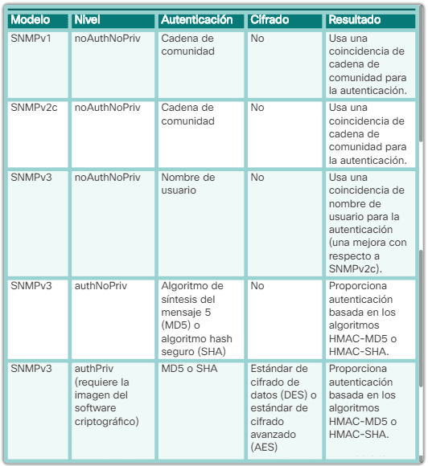

# Apunts SNMP

## Recursos
[SNMP MIBs & SNMP OIDs explained](https://www.comparitech.com/net-admin/snmp-mibs-oids-explained/)

[Buscador de MIBs](https://mibbrowser.online/mibdb_search.php)

## Arquitectura


Simple Network Management Protocol. És un protocol de capa d'aplicació. Consta de tres elements:

* L'administrador (NMS - Network Management System), que és el que obté informació dels clients.
* MIB (Management Information Base), que és la base de dades que enmagatzema la informació que obté l'administrador sobre els dispositius de xarxa. Resideix en cada agent. Cada agent té el seu propi MIB amb la informació local.
* Els agents, que són els que envien informació local cap al seu respectiu MIB.

>SNMP (Protocolo simple de administración de red) se desarrolló para permitir que los administradores puedan administrar los nodos, como los servidores, las estaciones de trabajo, los routers, los switches y los dispositivos de seguridad, en una red IP. Permite que los administradores de red administren el rendimiento de la red, detecten y resuelvan problemas de red, y planifiquen el crecimiento de la red.

## Tipus d'operacions
* *get*: Mitjançant un missatge de tipus *get*, l'administrador demana informació local a un agent.
* *set*: L'administrador modifica informació d'un dispositiu agent.
* *trap*: Els agents reenvien informació directament (sense un missatge *get* previ)

Es fa servir el port UDP 161 (des de l'agent) i el port UDP 162 (des de l'NMS per rebre *traps*) per aquest enviament d'informació. 

**Taula d'operacions de l'administrador i l'agent:**

| Operació | Descripció | 
| -------- | -------- | 
| *get-request*     | recupera el valor d'una variable concreta.     | 
| *get-next-request*     | recupera el següent valor dintre d'una taula. Aquí l'administrador no necessita conèixer el nom de la variable.     | 
| *get-bulk-request*     | recupera blocs de dades. Ens estalviem de fer diverses peticions *get*     | 
| *get-response*     | respon a una sol·licitud *get-request*, *get-next-request* o *get-bulk-request*     | 
| *set-request*     | enmagatzema el valor d'una variable específica i s'envia el nou valor a l'administrador     | 

## Traps
Els traps són missatges que envien els agents a l'administrador sense missatge *get* previ, automatitzats en base a una configuració prèvia des de l'administrador i que s'activen quan es compleix un event o una condició a la xarxa. Exemples:

* Autenticació incorrecta d'usuaris
* Els reinicis
* l'estat de l'enllaç (actiu o inactiu), 
* El seguiment d'adreces MAC
* El tancament d'una connexió TCP

Un dels aventatges és que no saturen el tràfic de xarxa amb missatges get i post de sondeig.


## Versions

    SNMPv1: el protocolo simple de administración de red, 
    un estándar de Internet completo, se define en RFC 1157.
    L'autenticació és mitjançant una cadena de comunitat.
    
    SNMPv2c: se define en las RFC 1901 a 1908; 
    utiliza el marco administrativo basado en cadenas de
    comunidad. Aquí podem definir més d'una cadena  
    i cadascuna pot tenir els seus permisos. S'afegeix
    la possibilitat d'obtenir blocs d'informació amb 
    una única petició *get* (get-bulk-request)
    
    SNMPv3: protocolo interoperable basado en estándares 
    definido originalmente en las RFC 2273 a 2275; 
    proporciona acceso seguro mediante la autenticación 
    y el cifrado de paquetes a través de la red.



## MiB
Base de dades jeràrquica (estructurada). Per cada variable o dada de la base de dades es genera un OID.

Hi han molts tipus de MiB. Cada MiB té els seus propis OIDs. Hi han MiB per Cisco, per Linux, per Mikrotik, MiB que engloben uns tipus de dades, etc.

## OID
Un OID (Object Identifier) és una seqüència de números separats per punts (.) que representa una jerarquia d'objectes en SNMP.

L’estructura segueix un esquema jeràrquic definit per l'ISO (International Organization for Standardization) i l’IANA (Internet Assigned Numbers Authority). L'estructura general d'un OID seria com:

```bash
1.3.6.1.2.1.1.1.0
```

| OID	| Descripció |
|-----|------------|
|1	| ISO (International Organization for Standardization)|
|3	| Org (Organitzacions)|
|6	| DoD (Department of Defense) – Assigna l'espai per a Internet|
|1	| Internet – Defineix els objectes relacionats amb Internet|
|2	| Management – Per a gestió de xarxes (MIB-II)|
|1	| MIB-II – Conté objectes estàndards SNMP|

El 0 final es fa servir per obtenir el valor escalar d'un OID.

### 1.3.6.1 - Internet

| OID	| Descripció |
|-----|------------|
| 1.3.6.1.1	| Directory – Directori de serveis (poc usat)|
| 1.3.6.1.2	| Management – Per a SNMP i gestió de xarxes|
| 1.3.6.1.3	| Experimental – Per a investigació i proves|
| 1.3.6.1.4	| Private – Per a empreses i fabricants|
| 1.3.6.1.5	| Security – Per a protocols de seguretat|
| 1.3.6.1.6	| SNMPv2 – Definicions específiques de SNMPv2|

### 1.3.6.1.2 - Management

| OID	| Descripció |
|-----|------------|
| 1.3.6.1.2.1	| MIB-II – Conté objectes de xarxa comuns| 
| 1.3.6.1.2.2	| Objectes específics de gestió de xarxa| 

### 1.3.6.1.2.1 - Objectes de xarxa

| OID	| Descripció |
|-----|------------|
1.3.6.1.2.1.1	|system – Info del dispositiu (nom, ubicació, contacte)
1.3.6.1.2.1.2	|interfaces – Estat i configuració de les interfícies de xarxa
1.3.6.1.2.1.4	|ip – Configuració i estadístiques de l’IP
1.3.6.1.2.1.6	|tcp – Estat de les connexions TCP
1.3.6.1.2.1.7	|udp – Estadístiques UDP
1.3.6.1.2.1.11	|snmp – Estadístiques sobre el mateix SNMP
1.3.6.1.2.1.17	|dot1dBridge – Taula MAC
1.3.6.1.2.1.5	|icmp – Estadístiques de paquets ICMP

### 1.3.6.1.4 - Private

Aquesta branca conté objectes definits per fabricants i empreses. Cada empresa té el seu espai reservat. Exemple:

OID	|Empresa/Fabricant
|-----|------------|
1.3.6.1.4.1.9	|Cisco
1.3.6.1.4.1.11	|HP
1.3.6.1.4.1.8072	|Net-SNMP (implementació SNMP per a Linux)

Per exemple, si el que vull és informació bàsica estàndard (aplicable a qualsevol switch de qualsevol fabricant), He d'anar a 1.3.6.1.2.1 (MIB-II). Si, en canvi, vull informació específica del fabricant (estat de ports, VLANs, configuració avançada), he d'anar a 1.3.6.1.4.1 (Private Enterprises MIBs).

### Taula vs branca a OID

Un OID pot tenir associat un valor escalar o referenciar a una branca o a una taula del MIB al qual pertany.

Una branca és qualsevol subnivell dins de l'OID jeràrquic i taula és una estructura de fil·les i columnes dins d'una branca. Per exemple, la taula `ifTable` (1.3.6.1.2.1.2.2), que té tantes fil·les com interfícies (en el cas de més avall, 3 interfícies), i que per columnes, té, per exemple:

* `ifIndex - 1.3.6.1.2.1.2.2.1.1`
* `ifDescr - 1.3.6.1.2.1.2.2.1.2`
* `ifType  - 1.3.6.1.2.1.2.2.1.3`