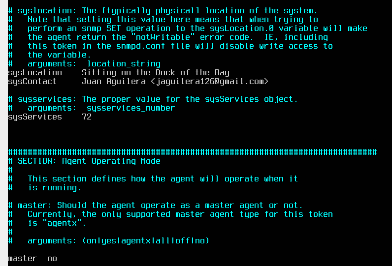
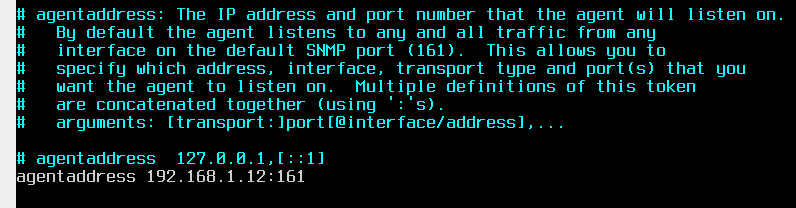
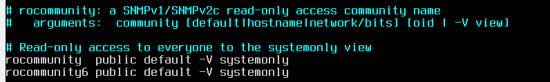
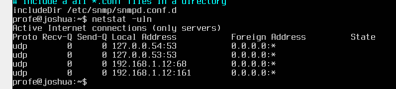
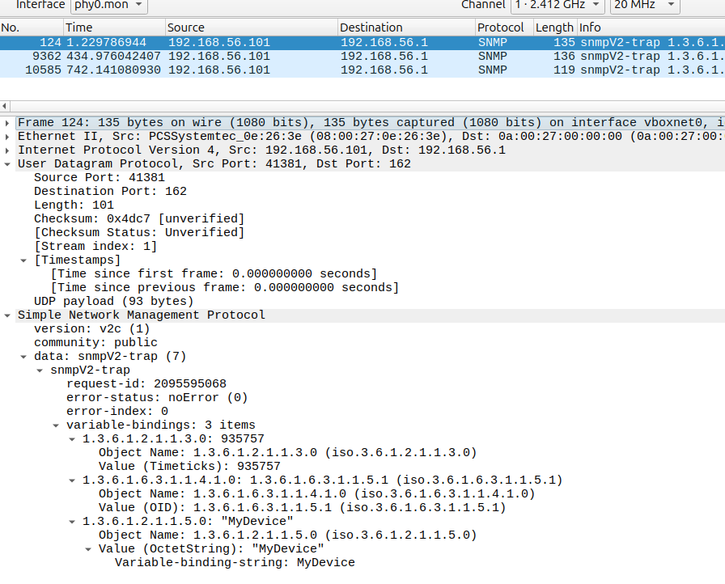

# Preparem l'entorn de proves. Linux com a agent SNMP

## Pas 1. Configurem el dimoni snmpd

He instal·lat el paquet `snmpd` en una màquina vuirtual Ubuntu Server 24.04 i he modificat algun paràmetre de la configuració per a que poguès escoltar peticions de la xarxa local.





He afegit a ferro la ip per la que vull que escolti l'agent. També puc afegir la línea 

```bash
agentaddress UDP:161
```

això farà que escolti per totes les interfícies en el port udp 161.

Després, vaig a afegir la següent línea per poder veure-ho tot en l'agent de cara a poder fer proves:

```bash
###########################################################################
# SECTION: Access Control Setup
#
#   This section defines who is allowed to talk to your running
#   snmp agent.

# Views 
#   arguments viewname included [oid]

#  system + hrSystem groups only
view   allview    included   .1
```

i reemplacem la directiva `rocommunity` per 

```bash
rocommunity  public  default -V allview
```

Vaig a fer proves de moment amb SNMPv1 i SNMPv2c en mode només lectura:



Finalment, fem un `$ sudo systemctl restart snmpd.service`.



## Pas 2. Instal·lem i configurem el client

```bash
$ sudo apt install snmp
```

Aquest paquet et permet de fer consultes a un agent. Si volem treballar amb noms i no directament amb OID, hem d'instal·lar també els MiB en el client, de cara a poder tenir l'estructura de la base de dades i els noms simbòlics dels objectes (OID) de la taula:

```bash
$ sudo apt install snmp-mibs-downloader
```

I comentar també la directiva `mibs` a `/etc/snmp/snmp.conf`:

```bash
# mibs: 
```

## Pas 3. Configurem agent per a poder fer operacions snmpset

`snmpset` implementa la petició `SNMP SET` per modificar valors OID. Pots modificar més d'un OID en la mateixa petició. En la sintaxi has d'indicar l'OID, el tipus de valor i el nou valor de l'OID. Segons `man snmpset`:

```bash
SYNOPSIS
       snmpset [COMMON OPTIONS] AGENT OID TYPE VALUE [OID TYPE VALUE]...
```
```bash
       The TYPE is a single character, one of:
              i  INTEGER
              u  UNSIGNED
              s  STRING
              x  HEX STRING
              d  DECIMAL STRING
              n  NULLOBJ
              o  OBJID
              t  TIMETICKS
              a  IPADDRESS
              b  BITS
```

Si en el client tenim carregat l'esquema del MIB al que referenciem en el snmpset podem ficar el signe `=` en comptes del tipus.

Exemple. Vaig a canviar les dades de contacte de l'agent:

```bash
joan@super-ThinkBook-14-G4-IAP:~$ snmpset -v2c -c public 192.168.56.101 system.sysContact.0 s "Pedro Picapiedra <pedrowillma@gmail.com>"
Error in packet.
Reason: noAccess
Failed object: SNMPv2-MIB::sysContact.0
```

Vaja. No m'ha deixat. Això és perque la cadena de comunitat que estic fent servir (*public*) és de lectura només. Si vaig al fitxer de configuració de l'agent (`rocommunity  public  default -V allview`):

```bash
rocommunity  public  default -V allview
```

He de crear una altra cadena per lectura i escriptura:

```bash
rocommunity  public  default -V allview
rwcommunity  private  default -V allview
```

I reinicio l'agent:

```bash
profe@joshua:~$ systemctl restart snmpd.service 
==== AUTHENTICATING FOR org.freedesktop.systemd1.manage-units ====
Authentication is required to restart 'snmpd.service'.
Authenticating as: Juan Aguilera (profe)
Password: 
==== AUTHENTICATION COMPLETE ====
```

I torno a provar. Però em torna a donar un error, encara que lleugerament diferent:

```bash
joan@super-ThinkBook-14-G4-IAP:~$ snmpset -v2c -c private 192.168.56.101 system.sysContact.0 s "Pedro Picapiedra <pedrowillma@gmail.com>"
Error in packet.
Reason: notWritable (That object does not support modification)
Failed object: SNMPv2-MIB::sysContact.0
```

Ara no em diu que no tinc accés, sinó que l'objecte que vull modificar no és modificable (*notWritable*). Això és perquè en l'arxiu '/etc/snmp/snmpd.conf` tinc configurat el valor de sysContact amb un valor que no puc modificar. Si el vull modificar he de comentar la línea corresponent:

```bash
# syslocation: The [typically physical] location of the system.
#   Note that setting this value here means that when trying to
#   perform an snmp SET operation to the sysLocation.0 variable will make
#   the agent return the "notWritable" error code.  IE, including
#   this token in the snmpd.conf file will disable write access to
#   the variable.
#   arguments:  location_string
sysLocation    Sitting on the Dock of the Bay
# sysContact     Juan Aguilera <jaguilera126@gmail.com>

# sysservices: The proper value for the sysServices object.
#   arguments:  sysservices_number
sysServices    72
```

Reinicio i torno a provar:

```bash
joan@super-ThinkBook-14-G4-IAP:~$ snmpset -v2c -c private 192.168.56.101 system.sysContact.0 s "Pedro Picapiedra <pedrowillma@gmail.com>"
SNMPv2-MIB::sysContact.0 = STRING: Pedro Picapiedra <pedrowillma@gmail.com>
```

## Pas 4. Configurar l'agent i el NM per a l'enviament de traps

Els *TRAPS* a **SNMP** són notificacions des de l'agent cap al *SNMP manager*. A Linux, podem rebre TRAPS d'agents amb el dimoni *snmptrapd* instal·lat al *SNMP Manager*. 

A un agent Linux podem enviar *TRAPS* amb la comanda `snmptrap`. La sintaxi de la comanda depèn molt de la versió de *SNMP*, però bàsicament, hem d'especificar la versió, la cadena de comunitat del *Network Manager*, l'adreça del *Network Manager*, un OID de tipus trap (OID_trap) i un o més OIDs amb valors.

Hi han dues categories de traps:

1. Genèrics

2. Específics, creats per empreses

Els OID de traps genèrics són els següents:

```bash
joan@super-ThinkBook-14-G4-IAP:~$ snmptranslate -Tp .1.3.6.1.6.3.1.1.5
+--snmpTraps(5)
   |
   +--coldStart(1)
   +--warmStart(2)
   +--linkDown(3)
   +--linkUp(4)
   +--authenticationFailure(5)
```

Anem a fer la primera prova. Primer, haurem de configurar el *SNMP Manager* per a que pugui escoltar possibles notificacion:

```bash
joan@super-ThinkBook-14-G4-IAP:~$ apt search snmptrap
S'està ordenant… Fet
Cerca a tot el text… Fet
libnetsnmptrapd40t64/noble 5.9.4+dfsg-1.1ubuntu3 amd64
  SNMP (Simple Network Management Protocol) trap library

snmptrapd/noble 5.9.4+dfsg-1.1ubuntu3 amd64
  Net-SNMP notification receiver

snmptrapfmt/noble 1.18 amd64
  configurable snmp trap handler daemon for snmpd

snmptt/noble,noble 1.5-1 all
  SNMP trap handler for use with snmptrapd
```

D'aquests paquets, m'interessa instal·lar el paquet `snmptrapd`.

De quina manera puc processar els traps a snmptrapd? `man snmptrapd.conf`:

```bash
There are currently three types of processing that can be specified:

              log    log  the  details of the notification - either in a specified file,
                     to standard output (or stderr), or via syslog (or similar).

              execute
                     pass the details of the trap to a specified  handler  program,  in‐
                     cluding embedded perl.

              net    forward the trap to another notification receiver.
```

Descomento / afegeixo aquestes línees en el fitxer de configuració `/etc/snmp/snmptrapd.conf` (*SNMP Manager*):

```bash
disableAuthorization yes
authCommunity log,execute,net public
snmpTrapdAddr udp:162
```

Fem un restart del servei i ja tenim actiu el port 162 per escoltar traps:

```bash
joan@super-ThinkBook-14-G4-IAP:~$ sudo netstat -ul | grep snmp
udp        0      0 localhost:snmp          0.0.0.0:*                          
udp        0      0 0.0.0.0:snmp-trap       0.0.0.0:*                          
udp6       0      0 ip6-localhost:snmp      [::]:*                             
udp6       0      0 [::]:snmp-trap          [::]:*                             
```

Exemple de *TRAP* enviat des de client amb la comanda `snmptrap`:

```bash
profe@joshua:~$ snmptrap -v2c -c public 192.168.56.1 '' SNMPv2-MIB::coldStart.0 SNMPv2-MIB::sysName.0 s "MyDevice"
```

Aquesta comanda envia un trap amb la versió 2c a la cadena de comunitat *public* i al *SNMP Manager* 192.168.56.1. És un *TRAP* de tipus `coldStart` i EL *TRAP* passa el `sysName` amb valor *MyDevice*. A part dels OIDs amb llurs valors que afegim al trap i del OID_type, també s'envia per defecte l'OID `sysUpTime`:



**Exemple de com gestionar els traps rebuts**

Anem a fer que els traps rebuts s'escriguin el fitxer de log `/var/log/trap.log`. Per això, he fet l'script en bash `snmptrap2log.sh:

```bash
#!/bin/bash
# Escric els traps a un fitxer de logs
LOG_F=/var/log/trap.log

DATA=$(date +"%Y-%m-%d %T")

while read line; do
	echo "Capturat trap -- $DATA -- " >> $LOG_F
	echo "----------------------------------" >> $LOG_F
	echo "$line" >> $LOG_F
	echo "----------------------------------" >> $LOG_F
	echo >> $LOG_F
done
```

Per a que aquest script pugui procesar el *TRAP* he d'afegir també la següent línea al `snmptrapd.conf`:

```bash
traphandle default /usr/bin/snmptrap2log.sh
```

Quan executo des de l'agent el *TRAP* d'abans, obtinc:

```bash
Capturat trap -- 2025-02-28 10:06:23 -- 
----------------------------------
<UNKNOWN>
UDP: [192.168.56.101]:56365->[192.168.56.1]:162
SNMPv2-MIB::snmpTrapOID.0 SNMPv2-MIB::coldStart.0
SNMPv2-MIB::sysName.0 MyDevice
----------------------------------
```